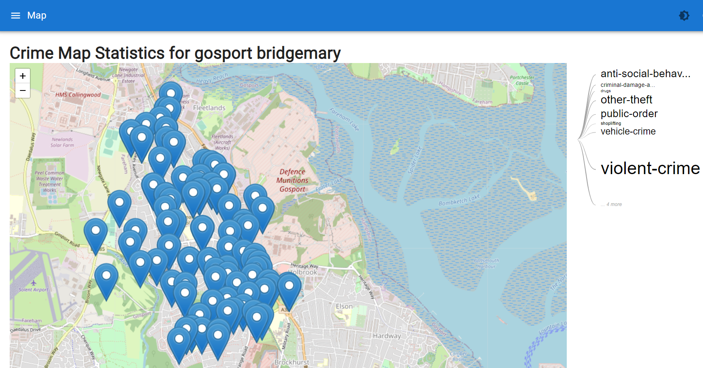

<style>
section {
  padding: 50px;
  background: #333333;
  --color-foreground: #d7d8dc;
  line-height: 110%
}
header {
   position: absolute;
   left: 1%;
   right: 99%;
   top: 5px;
},
footer {
  position: absolute;
  left: 50px;
  right: 50px;
  height: 20px;
  color: #d7d8dc;
  text-shadow: 0 0 black;
  bottom: 11
  px;
}
section code {
  color: #000!important;
  background: #d7d8dc!important;
}
h1 {
  left:12%;
  line-height: 100%;
  padding-left: 150px
}
a:link {
   color : #d7d8dc;
  }
</style>
<style scoped>
section {
  padding: 50px;
  line-height: 100%;
  font-size: 36px;
  padding-top:155px
}
h1 {
  padding-left: 180px;
  line-height: 200%;
  position: absolute;
  top: 2%;
  font-size: 80px;
}
</style>
# A Big Thanks To 


---

# WhoAmI

My name is Adam Bacon and I have been working in IT since 1999. I did not come from a coding background, and started from the bottom to get where I am today. This talk is aimed for people at any level of Powershell, I want to enlighten you that although Powershell is totally awesome, sometimes the output does not show just how amazing your script is. This is what I want to show you, is how to make your scripts more awesome, by displaying the output of your code in a number of ways to make your script more appreciated

---

# Powershell To The Rescue

I was lucky enough to embrace Powershell when it came out. As I wanted to improve my IT career, and I certainly feel it has done that. Powershell has saved my bacon multiple times to deliver an automated script or function to solve the problem. It has even led to me building bespoke software to manage or record certain parts of business processes. When I began learning Powershell I never envisaged that I would be able to do this. Until I became the scripting guy at work, and had to provide solutions that anybody in the company could use.

---
<style scoped>
  h1 {
  position: absolute;
  left:1%;
  line-height: 100%;
  top: 5%
}
section {
  padding-top: 150px;
  background: #333333;
  --color-foreground: #d7d8dc;
  line-height: 110%
}
a:link {
   color : #d7d8dc;
  }
section a {
  color : #d7d8dc;
  }
</style>

# https://adam-bacon.netlify.app

Is a personal blog-site I started last year, detailing various Powershell projects I was working on. I totally recommend putting your work or ideas out there on the internet for others to see. Blogging certainly helped me, and it was doing something I enjoyed, which was Powershell. Plus I was also learning new things whilst making new modules, as well as new friends and new projects to help out on. Today we will look at one of these modules as an example of outputting data  

---

# Thank You

Thank you all for joining me to learn about how to turn plain looking Powershell output into something more beautiful to impress your friends or work colleagues. This presentation has been designed to open your mind with endless possibilities on making your scripts visually output something more attractive to the eye. Not only does this look better, but will also help those you present it to understand the data more easily.

---

# Making Output Beautiful

So what do I mean by this? Can you really define something as beautiful by the way you present it? I will let you be the judge of  that. I am not here to show you how to write more efficient code, I want to demonstrate other ways you can present your scripts, so even the anti-scripters at work will want to be your new best friend. I want to inject new ideas into your brain, on different possibilities on displaying output using your Powershell script you write. As pretty much all scripts will produce output, this is what I want to focus on today

---

# Modules We Will Look At

Let us explore a few modules that can help present the output in other ways that will gain more attention.

- **PSWriteHTML**
- **ImportExcel**
- **Pode.Web**
- **Powershell Universal**

I will be using the **Find-CrimeUK** module I made to go through this whole journey of making output more appeasing to the eye of the person viewing it.

---
<style scoped>
section {
  padding: 50px;
  line-height: 100%;
  font-size: 36px;
  padding-top:155px
}
h1 {
  padding-left: 40px;
  line-height: 110%;
  position: absolute;
  top: 2%;
  font-size: 80px;
}
</style>
# Brief Overview Of Module Find-CrimeUK

This module was from a casual conversation with a friend about crime, and that got me thinking of all the crime you do not get to read in the paper and all the local crime happening that you may not know about. As I also love comic books, this brought out the super-hero in me to find the crimes and present them to the public, as the official Police API seems pretty user un-friendly. Plus the fact I didn't know an API existed so this information can now be done in Powershell using the following
```
Find-CrimeUK -LocationName Gosport -Year 2022 -Month 12
```
---
# Find-CrimeUK

Is a module I published in August 2022. This module uses the UK Police API to retrieve crimes from a given latitude and longitude you provide to the API.

https://data.police.uk/docs/method/crime-street/

To make this easier I implemented another web request 

https://geocode.maps.co/

That allowed me to gain the latitude and longitude via a name of a location.

---

<style scoped>
section {
  padding: 50px;
  background: #333333;
  --color-foreground: #d7d8dc;
  line-height: 140%;
  font-size: 32px;
  padding-top:200px
}
h1 {
  padding-left: 120px;
  line-height: 200%;
  position: absolute;
  top: 5%;
  font-size: 80px; 
}
</style>

# Output


So the output in the Powershell console didn't look to great. So I opted to use the **Out-GridView** cmdlet to make this output as presentable as possible. Today we can have a butchers at how else we can present this data. To make it more easier to understand, and easier on the eye.

---
<style scoped>
section {
  padding: 50px;
  background: #333333;
  --color-foreground: #d7d8dc;
  line-height: 90%;
  font-size: 30px;
  padding-top:200px
}
h1 {
  padding-left: 110px;
  line-height: 200%;
  position: absolute;
  top: 2%;
  font-size: 60px;
  
}
</style>

# PSWriteHTML

Option one is we could use this module, which would take about 5 seconds to adjust the original module changing
```
$Props | Out-Gridview
```
to
```
$Props | Out-HtmlView
```
Which would then generate a snazzy looking webpage with all the data and giving you some additional export options

---
<style scoped>
section {
  padding: 50px;
  background: #333333;
  --color-foreground: #d7d8dc;
  line-height: 100%;
  font-size: 28px;
  padding-top:200px
}
h1 {
  padding-left: 40px;
  line-height: 200%;
  position: absolute;
  top: 2%;
  font-size: 80px;
}
</style>

# PSWriteHTML Dashboard

You have the capability of producing dashboards with this module as well. In under 40 lines of code I was able to make this dashboard from the data returned from **Find-CrimeUK** I exported that data to CSV this time from the module, to produce this

---
<style scoped>
section {
  padding: 50px;
  background: #333333;
  --color-foreground: #d7d8dc;
  line-height: 100%;
  font-size: 28px;
  padding-top:200px
}
h1 {
  padding-left: 110px;
  line-height: 100%;
  position: absolute;
  top: 2%;
  font-size: 80px;
}
</style>
# ImportExcel

You will have to know a bit about Excel to be able to use this, as in knowing about charts and pivot tables, as personally this is how I like to display my end-data in Excel to make it more digestable to the end-user. None of this is rocket science and is a massive help in breaking the data down to display the output easier. To make the above Pivot-Table output, including a styled table on the first sheet with conditional formatting only took 3 lines of code!

---

# Pode.Web

This is a web template framework for use with the Pode PowerShell web server (v2.6.0+).
It allows you to build web pages purely with PowerShell - no HTML, CSS, or JavaScript knowledge required!
You can build charts, forms, tables, general text, tabs, login pages, etc. There's a light, dark, and terminal themes, and you can supply a custom CSS file
Again using the output of the Find-CrimeUK module, and exporting this to CSV, I was able to construct a nice looking dashboard in 60 lines of code

---
<style scoped>
section {
  padding: 50px;
  background: #333333;
  --color-foreground: #d7d8dc;
  line-height: 100%;
  font-size: 32px;
  padding-top:200px
}
h1 {
  padding-left: 160px;
  line-height: 200%;
  position: absolute;
  top: 2%;
  font-size: 80px;
}
</style>
# Pode.Web Output

This is now looking close to the finished product I would have preferred to have given the end-user. Lets see if we can make the output even better, and maybe turn this into an application.

---

# Powershell Universal

There is a saying that you save the best until last, well I hope you have been impressed with what you have seen so far, on how you can transform your console data into something so much more visual to emphaisze the data output being presented. 
This last Powershell demonstration will involve using Powershell Universal which is actually an MSI installer or EXE and not a module. This has been around for a good number of years now, and when it first came out it was a module called Universal Dashboard. 

---
<style scoped>
section {
  padding: 50px;
  background: #333333;
  --color-foreground: #d7d8dc;
  line-height: 100%;
  font-size: 38px;
  padding-top:200px
}
h1 {
  padding-left: 180px;
  line-height: 200%;
  position: absolute;
  top: 2%;
  font-size: 80px;
}
</style>
# Powershell Universal

As mentioned this was a module which was called Universal Dashboard, and allowed you to build web-based dashboards with no HTML or React knowledge. This was such a massive game changer for me I did a blog for a couple of years on the various custom components I built

https://psdevuk.github.io/ud-flix/ 

the module matured into a software package which exposes scripts as RESTful HTTP APIs for integration with any platform, Automation Jobs and Dashboards

https://ironmansoftware.com/powershell-universal-dashboard

---
<style scoped>
section {
  padding: 50px;
  line-height: 100%;
  font-size: 36px;
  padding-top:155px
}
h1 {
  padding-left: 140px;
  line-height: 200%;
  position: absolute;
  top: 2%;
  font-size: 80px;
}
</style>
# Powershell Universal

I would like to use what we have covered so far, to make a mini-application from this **Find-CrimeUK** module, and display the results in a number of visual ways
